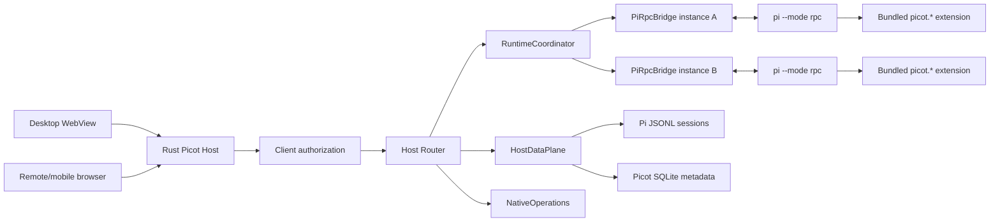

# Picot Native Runtime Architecture

Status: **Approved through grilling review on 2026-07-14**

## Goal

Replace Picot's duplicated embedded runtime bridge with one host-owned architecture that exposes the
embedded Pi `0.80.7` runtime faithfully, preserves concurrent agents, and supports desktop,
remote, and mobile clients through one interface.

This design includes both the architecture migration and the missing Pi capability work. They ship
together in one product release after the full acceptance matrix passes.

## Frozen decisions

- Embedded Pi is frozen at `0.80.7` for this migration.
- Rust Host is the only HTTP/WebSocket server.
- Pi processes communicate only through stdin/stdout JSONL RPC and do not open TCP ports.
- Broker protocol v2 replaces v1 atomically; no compatibility adapter ships.
- Each running Pi process owns exactly one live session for its lifetime.
- Pi native RPC is authoritative for runtime behavior.
- A bundled `picot.*` extension bridge may expose Pi-owned behavior missing from RPC.
- Project Trust blocks workspace startup and defaults to deny.
- Runtime, project-default, and global-default settings are distinct scopes.
- Pi-native steer/follow-up queues replace the browser-only queue.
- Slash commands are formal syntax; `//` sends a literal leading slash.
- Extension UI may block an agent and is strictly routed to its session.
- Session trees are first-class; the chat view renders only the active branch.
- Fork/clone preserve the source process and require it to be idle.
- OAuth reuses Pi providers and `AuthStorage`.
- Import and share are out of scope.
- Session indexing/FTS optimization is out of scope; preserve current scan behavior.
- Remote access uses QR pairing and device tokens but retains the existing unencrypted LAN transport
  for this release. This is an accepted security risk.
- Picot metadata uses SQLite; Pi-owned data remains in Pi-owned files.
- The frontend stays vanilla JS and uses reducer-based stores.
- Development may select old or new architecture, but the product performs one atomic cutover.

## Why the current architecture must be replaced

The current system has three overlapping runtime paths:

1. Pi's native RPC implementation on subprocess stdin/stdout.
2. `extensions/embedded-server.ts`, which reimplements a partial RPC surface with Extension API calls.
3. Frontend commands split between broker WebSocket frames and per-process HTTP `/api/rpc`.

Rust discards Pi stdout, so native responses, prompt preprocessing, queue state, extension UI, branch
operations, and full statistics are unavailable. The embedded extension then approximates some of
them, including successful no-ops such as auto-compaction. Every Pi process also owns a web server and
port, coupling page navigation and session identity to process lifecycle.

The new design removes those duplicated responsibilities instead of expanding them.

## System architecture



There is no per-Pi HTTP server, WebSocket server, or externally visible port.

## Deep modules and seams

### `RuntimeGateway` — frontend runtime seam

Location: `public/runtime-gateway.js`

```js
runtime.request(command, target, options)
runtime.subscribe(listener)
runtime.snapshot(sessionId)
runtime.capabilities(instanceId)
```

Interface invariants:

- `target` contains `instanceId` and `sessionId`; both must match in the Host registry.
- Mutations require a stable `idempotencyKey` and are never automatically retried when acceptance is
  unknown.
- Read-only requests may retry after reconnect.
- Responses return only to the requesting client.
- Events include `workspaceId`, `sessionId`, `instanceId`, and a monotonic instance sequence.
- A sequence gap triggers snapshot recovery.
- Callers never see subprocess JSONL, WebSocket envelopes, filesystem paths, or ports.

Production uses the Host WebSocket adapter. Tests use an in-memory adapter through the same interface.

### `RuntimeCoordinator` — Host runtime seam

Location: Rust, owned by `PiManager` or its replacement.

Responsibilities:

- Spawn, observe, suspend, resume, and stop Pi instances.
- Enforce one process to one live session.
- Validate instance/session routing.
- Own every `PiRpcBridge`.
- Maintain request correlation, idempotency records, and event sequence.
- Convert process failures into explicit runtime state.
- Never perform Pi session/compaction/branch algorithms.

### `PiRpcBridge` — subprocess adapter

One adapter exists per Pi process:

- Writes strict LF-delimited JSON to stdin.
- Reads strict LF-delimited responses and events from stdout.
- Keeps stderr as diagnostic output.
- Correlates native Pi IDs with Host requests.
- Rejects pending requests on timeout or process exit.
- Bounds frame size, pending requests, and recent idempotency records.
- Surfaces startup-time trust and extension UI requests.

### `HostDataPlane` — local read model

The Rust Host replaces the HTTP/data portion of `embedded-server.ts`:

- Static frontend assets.
- Session list and current scan-based search.
- Cost dashboard using existing scan behavior.
- Workspace-scoped file browsing/search/open requests.
- Model preference and package catalog data where not provided by RPC.
- Health, version, remote QR, and client authorization endpoints.

It may read Pi JSONL but must not modify session entries, branches, or compactions. Unknown JSONL entry
types are tolerated. Indexing and FTS are explicitly deferred.

### `PicotBridgeExtension` — upstream gap adapter

The bundled extension has no HTTP or WebSocket server. It may register namespaced operations such as:

- `picot.navigateTree`
- `picot.reloadResources`
- `picot.projectTrust`
- `picot.oauthLogin`

Every operation must call existing Pi-owned behavior such as `ctx.navigateTree()`, `ctx.reload()`, Pi
OAuth providers, or Pi trust callbacks. It may not reproduce prompt expansion, queue, compaction,
session-writing, or model execution. When Pi adds a native RPC command, the bridge operation is removed.

## Identity model

### `workspaceId`

A stable opaque ID stored in Picot SQLite and mapped to a canonical local path inside the Host.
Clients never submit arbitrary workspace paths as runtime identity.

### `sessionId`

The Pi session UUID. A new session receives a Host temporary ID until Pi persists the formal session,
then the Host atomically binds the real ID and the frontend replaces its route.

### `instanceId`

A random opaque ID assigned on every Pi process start. Suspend/resume keeps `sessionId` but changes
`instanceId`.

Ports and JSONL paths are diagnostics/storage details, never routing keys.

Every runtime mutation targets:

```text
workspaceId + sessionId + instanceId + requestId + idempotencyKey
```

## Broker protocol v2

Handshake:

```json
{
  "type": "hello",
  "protocolVersion": 2,
  "clientType": "desktop",
  "clientId": "opaque"
}
```

Runtime frames:

```json
{"type":"runtime_request","requestId":"...","idempotencyKey":"...","target":{"workspaceId":"...","sessionId":"...","instanceId":"..."},"command":{}}
{"type":"runtime_response","requestId":"...","acceptance":"accepted","response":{}}
{"type":"runtime_event","target":{},"sequence":42,"event":{}}
{"type":"runtime_snapshot","target":{},"sequence":42,"state":{}}
```

Host frames use a separate namespace for file dialogs, process controls, updater, packages, and native
application operations. Remote clients cannot call dangerous Host operations.

Protocol version mismatch is a hard error with a refresh/restart message. There is no silent fallback
and no v1 translation.

## Process and session lifecycle

### One process, one live session

- New session starts a new process.
- Opening an inactive session starts a new process with `--session`.
- Selecting an already-running session attaches to its existing instance.
- No live process receives native `new_session` or `switch_session` to replace its identity.
- Tree navigation remains legal because it changes the active branch inside the same session.

### Lifecycle states

```text
starting → trusting → ready/working → idle → suspended
                       ↘ crashed
                       ↘ stopped
```

Auto-suspend rules:

- Visible, working, queued, retrying, compacting, or dialog-blocked instances never suspend.
- A background idle instance suspends after 30 minutes.
- At most eight background idle instances remain warm; excess instances suspend by LRU.
- Settings may disable or adjust suspend behavior.
- Resume creates a new `instanceId` and hydrates from the Pi session.

### Crash recovery

Process crash never automatically continues an unfinished turn or tool call. The Host restores only
persisted session state. Accepted-but-incomplete mutations become `outcome_unknown`; the user decides
whether to inspect, edit/resend, or remain suspended.

## Request acceptance and idempotency

Mutations include prompt, steer, follow-up, compact, bash, fork, clone, navigation, and settings that
change live state.

- The client creates one idempotency key per user intent.
- The Host caches recent accepted keys per instance.
- A duplicate key returns the prior acceptance/result and is not sent to Pi again.
- Disconnect after acceptance never causes an automatic retry.
- UI distinguishes rejected-before-acceptance, accepted, completed, failed-after-acceptance, and
  outcome-unknown.
- Read-only requests such as state, tree, commands, and stats may retry.

## Frontend navigation and state

All windows use one Host origin. Canonical routes are:

```text
/app/workspaces/:workspaceId/launcher
/app/workspaces/:workspaceId/sessions/:sessionId
/app/settings
```

Routes contain opaque IDs only. Process restart, suspend, or port changes do not affect navigation.

Each session owns a reducer-based `SessionStore` containing process status, active-branch messages,
streaming output, tools, queues, retry/compaction, dialogs, model/thinking, context, and cost.

```text
RuntimeGateway → normalized actions → SessionStore reducer → selectors → DOM render modules
```

DOM is never authoritative state. Events apply only when their sequence is contiguous; otherwise the
store requests and hydrates an authoritative snapshot. Background events update only their session
store.

## Project Trust

Workspace startup stops in `trusting` when Pi reports project resources requiring a decision. The
bundled CLI extension handles Pi's `project_trust` event before project resources load.

User choices:

- Trust once.
- Trust and remember.
- Open untrusted.
- Cancel workspace opening.

No UI, disconnect, or timeout defaults to untrusted/deny. Picot uses Pi `trust.json` and does not
create a second trust database. Untrusted state is visible in the workspace UI.

## Settings scopes

- `Current Session`: native Pi runtime setters.
- `Project Default`: atomic merge into `<workspace>/.pi/settings.json`, only when trusted.
- `Global Default`: atomic merge into `~/.pi/agent/settings.json`.

Every setting displays its effective value and source. Unknown keys are preserved. Removing an
override falls back to the parent scope. Runtime changes do not persist unless the user explicitly
saves a default. Restart-required settings say so.

## Prompt, slash command, and queue semantics

- Idle Enter sends native `prompt`.
- Working Enter sends native `steer`.
- Working Alt+Enter sends native `follow_up`.
- Queue state comes only from native `queue_update` and snapshots.
- Steering and follow-up each support `one-at-a-time` and `all`.
- Registered built-in equivalents, extension commands, prompt templates, and skills appear in one
  menu with source and scope.
- Unknown `/command` is rejected.
- `//text` sends literal `/text`.
- Built-in equivalents invoke Picot actions; extension/prompt/skill commands use native Pi `prompt`
  and expand once.

## Tree, fork, and clone

The session file is a tree; chat shows only the active branch. A tree navigator shows all branches,
labels, compactions, summaries, and active leaf.

Navigation requires idle state and offers summary, no summary, or cancel. It calls Pi-owned
`ctx.navigateTree()` through `picot.navigateTree`, then replaces the visible active branch from a
snapshot.

Fork/clone:

- Require source idle and stable `sessionId + leafId`.
- Create a new process and new session while preserving the source instance.
- Use Pi-owned fork/clone behavior only; Picot never rewrites JSONL.
- Stop at an implementation review gate if safe source-preserving behavior cannot be proven.

## Extension UI

Supported RPC-safe methods:

- Blocking: select, confirm, input, editor.
- Non-blocking: notify, status, string widget, title, editor prefill.

Blocking requests are bound to extension, session, instance, and owning foreground client. A background
session shows a pending indicator until selected. Disconnect, timeout, session stop, or process exit
returns cancelled. Security prompts cannot be auto-approved. Extension text is untrusted and escaped.

TUI-only custom components, overlays, editor/header/footer replacement, theme mutation, component
widgets, terminal shortcuts, and terminal renderers are explicitly unsupported.

## OAuth

Picot enumerates OAuth providers from Pi and reuses their callback implementations. Picot supplies
generic browser opening, device-code display, input, progress, cancellation, and timeout UI. Pi
`AuthStorage` is the only credential store. Credentials never enter browser storage, SQLite, broadcast
events, or logs. Unsupported TUI-only providers are reported rather than reimplemented.

## Remote access

Remote access preserves the current unencrypted LAN transport for this release; prompts and source may
therefore be observable on the local network. The UI must warn about this accepted limitation.

Authentication uses QR only:

1. Host creates a single-use pairing token with a five-minute expiry.
2. QR carries the Host URL and pairing token.
3. The remote client exchanges it for a revocable long-term device token.
4. Host stores only the long-term token hash.

Remote clients may use chat/session runtime capabilities but cannot invoke dangerous native Host
operations such as folder picking, opening local apps, package changes, updates, or workspace deletion.

## Picot SQLite ownership

SQLite stores only Picot metadata:

- Stable workspace IDs.
- Paired remote devices and token hashes.
- Pinned/archived/last-viewed UI metadata.
- Suspend policy and Picot UI preferences.
- Schema migration version.

It does not store session content, API/OAuth credentials, Pi settings, or trust decisions. Database
loss resets Picot metadata but cannot damage Pi sessions.

## Delivery strategy

Development builds can select legacy or new architecture at process startup, never both for one Pi
process. The new system first proves a vertical slice, then accumulates all parity work. Production
ships one atomic cutover only after every acceptance gate passes. The release removes legacy protocol,
per-Pi servers, port routing, and duplicated runtime handling together.

## Explicitly deferred

- Session import.
- GitHub gist sharing.
- Encrypted remote transport.
- Incremental session index and FTS.
- Arbitrary Pi TUI rendering in HTML.

## Success criteria

- One Rust Host serves every local and remote client.
- Pi processes expose no TCP listeners.
- Native 0.80.7 contract tests cover commands, events, thinking, queues, and extension UI.
- Prompts and mutations execute at most once per idempotency key.
- Reconnect and sequence gaps recover through snapshots without duplicate DOM output.
- Concurrent workspaces/sessions cannot misroute commands or dialogs.
- Trust gates project code before execution.
- Suspend/resume preserves session identity and changes instance identity.
- Crash recovery never replays unknown mutations.
- Queue, slash, settings, tree, fork/clone, OAuth, and extension UI match the approved semantics.
- Remote QR tokens cannot authorize dangerous Host operations.
- Legacy embedded HTTP/WebSocket/runtime code is deleted.
